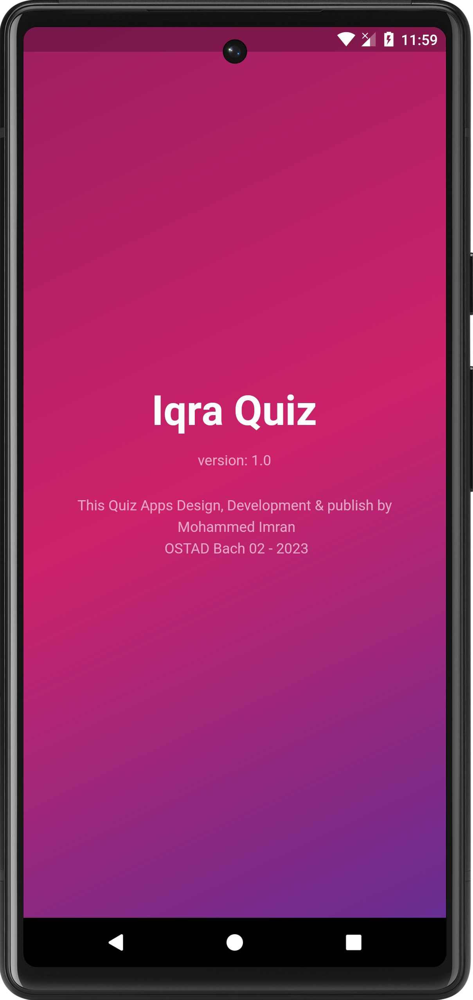
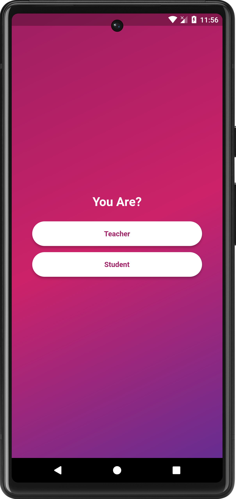
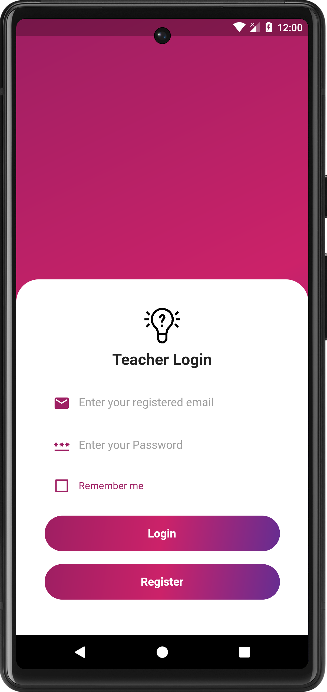
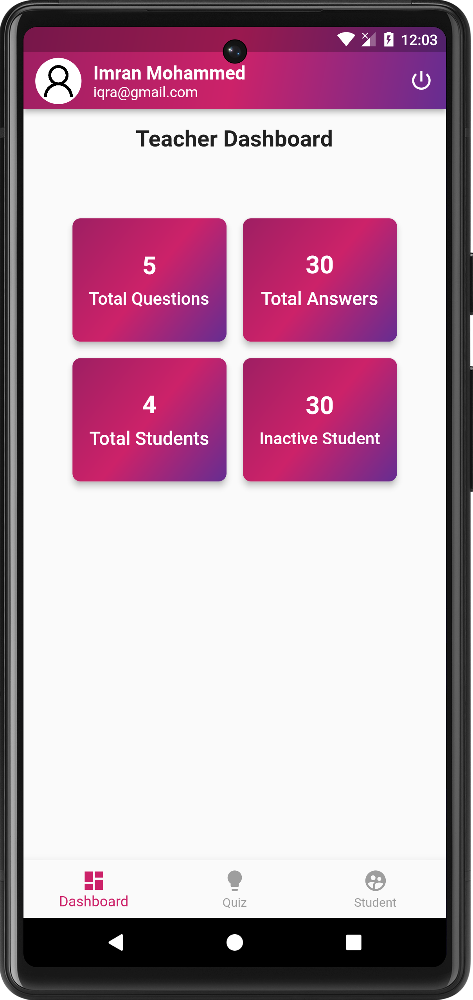
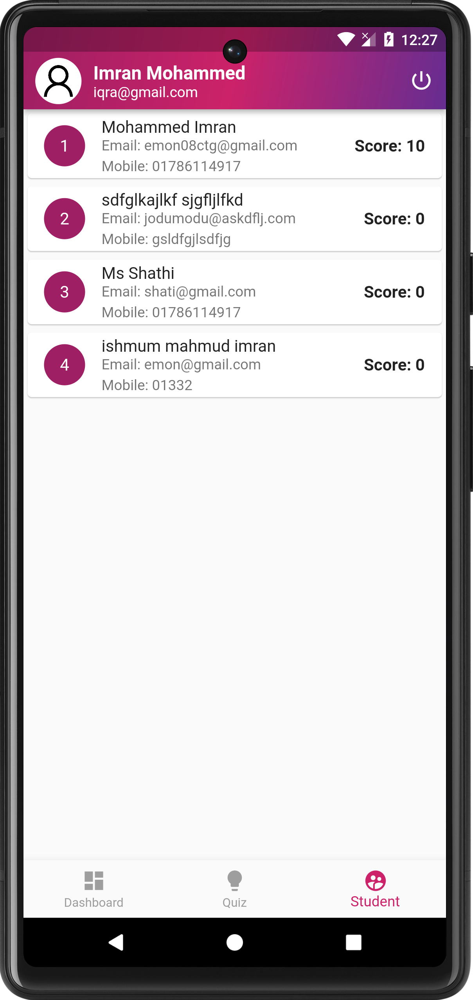
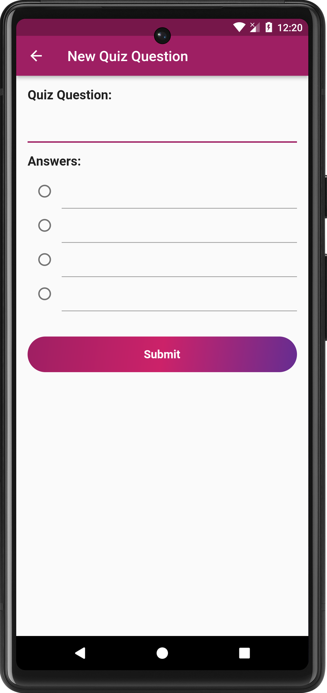
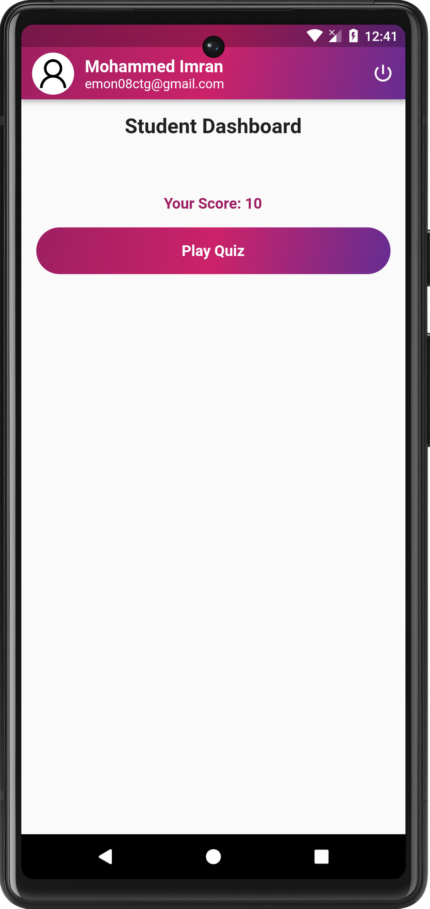
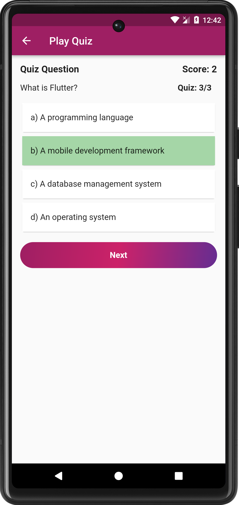
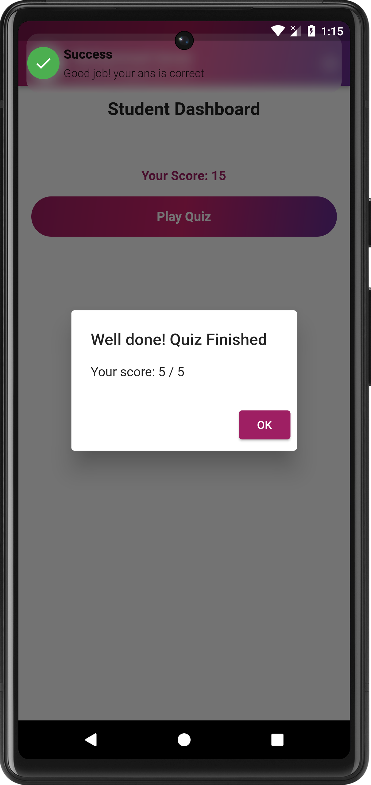

# quize_app_teacher_student_module

A new Flutter project.

## Getting Started

This project is a starting point for a Flutter application.

A few resources to get you started if this is your first Flutter project:

- [Lab: Write your first Flutter app](https://docs.flutter.dev/get-started/codelab)
- [Cookbook: Useful Flutter samples](https://docs.flutter.dev/cookbook)

For help getting started with Flutter development, view the
[online documentation](https://docs.flutter.dev/), which offers tutorials,
samples, guidance on mobile development, and a full API reference.

## Iqra Quiz App Download link
[Download Link](https://drive.google.com/uc?id=1gIqW1xePM9JQMFMj90_ioAjk_naQ-VWX&export=download)

## Splash Screen

## Select Module 
here we i have design two module 

## Teacher  Module Login Screen

## Teacher  Module Registration Screen

## Teacher  Module Dashboard Screen

## Teacher  Module quiz list Screen

## Teacher  Module add new quiz Screen

## Teacher  Module user list Screen

## Student Module Dashboard Screen

## Student Module Play quiz Screen

## Teacher  Module result Screen

