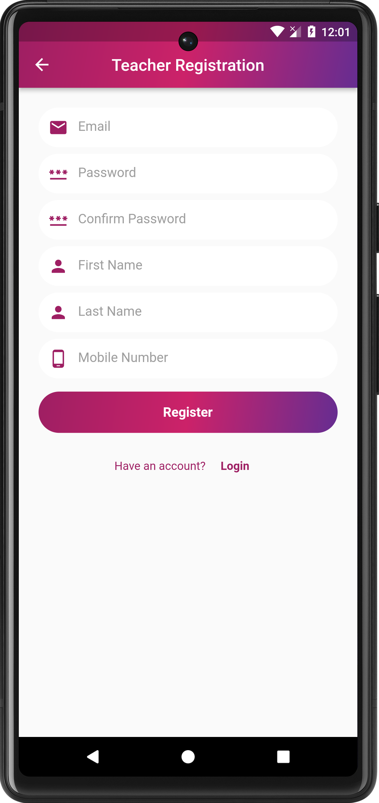

# quiz_app_teacher_student_module

A new Flutter project for ostad bacth 02 project assignment .

## Getting Started

Quiz App with Teacher and Student Modules

Objective: To build a quiz app that allows teachers to create quizzes and students to take quizzes.

Requirements:
1. Login Module:
- Implement a login module for both teachers and students using Firebase authentication.
- 
2. Teacher Module:
- Teachers should be able to create quizzes by adding questions.
- Teachers should have the ability to view the results of quizzes.
- 
3. Student Module:
- Students should be able to view the available quizzes.
- Students should be able to answer the questions and submit their answers.
- 
4. Dashboard:
- Create a dashboard for both teachers and students.
- Display relevant information such as available quizzes and ongoing quizzes.

5. Firebase Integration:
- Set up Firebase for authentication and database storage.

6. User Interface:
- Design a user-friendly interface for the app.

## Iqra Quiz App Download link
[Download Link](https://drive.google.com/uc?id=1gIqW1xePM9JQMFMj90_ioAjk_naQ-VWX&export=download)

## Splash Screen

## Select Module 
here we i have design two module 

## Teacher  Module Login Screen

## Teacher  Module Registration Screen

## Teacher  Module Dashboard Screen

## Teacher  Module quiz list Screen

## Teacher  Module add new quiz Screen

## Teacher  Module user list Screen

## Student Module Dashboard Screen

## Student Module Play quiz Screen

## Teacher  Module result Screen

